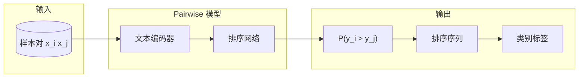

# 基于 Pairwise 排序实现文本分类的论文写作计划

## 论文定位

- **标题建议**：基于 Pairwise 排序的文本分类方法
- **语言**：中文
- **篇幅**：4-6 页（短文/workshop 风格）
- **领域**：自然语言处理（NLP）/ 文本分类

## 论文结构

### 1. 摘要（约 200 字）

- 问题：传统文本分类依赖点态（pointwise）绝对标签预测
- 思路：将分类问题重构为 pairwise 排序问题——比较样本对以确定相对类别倾向
- 方法：Pairwise 排序学习 + 排序结果到类别标签的映射
- 实验与结论：在若干文本分类任务上的效果与效率

### 2. 引言（约 0.5-1 页）

- 文本分类的背景与常见方法（如 CNN、BERT、传统分类器）
- 绝对标签的局限：标注噪声、边界样本难以判断
- Pairwise 思路的动机：相对比较更稳、可利用“A 比 B 更可能为正类”的隐式监督
- 本文贡献简述

### 3. 相关工作（约 0.5 页）

- **Learning to Rank**：Pointwise / Pairwise / Listwise 三种范式
- **Pairwise 方法**：RankNet、RankBoost、LambdaRank 等
- **排序与分类的结合**：将排序应用于分类任务的已有工作

### 4. 方法（约 1.5 页）

核心思路示意：

**4.1 问题形式化**

- 给定文档集 D，二分类目标：正/负类
- 构造样本对 (x_i, x_j)：若 y_i > y_j，则 x_i 应排在 x_j 前
- 学习目标：拟合 P(y_i > y_j | x_i, x_j)

**4.2 模型架构**

- 共享编码器（如 BERT/预训练语言模型）编码 x_i、x_j
- Pairwise  scoring：对表示做差值或拼接后进入 MLP，输出相对得分/概率
- 损失：pairwise 交叉熵（如 RankNet 形式）或 hinge loss

**4.3 从排序到分类**

- 方案 A：对每样本与一“锚点”样本比较，按得分聚合得到类别
- 方案 B：利用 pairwise 偏好聚合（如 Bradley-Terry）得到全局排序，再按阈值划分
- 方案 C：推断阶段直接使用 pairwise 得分作为分类依据

### 5. 实验（约 1-1.5 页）

**5.1 数据集**

- 情感分类：如 SST-2、IMDB
- 主题分类：如 AG News、THUCNews（如可用）

**5.2 基线**

- 点态分类：CNN、LSTM、BERT 等
- 可选：其他基于排序或 pairwise 的方法

**5.3 指标**

- 分类：Accuracy、F1
- 可选：训练/推理时间对比

**5.4 结果要点**

- Pairwise 方法在若干任务上可与或优于点态基线
- 在噪声标签、小样本等条件下的潜在优势（可用已有实验或设计简化验证）

### 6. 结论（约 0.3 页）

- 总结：将分类建模为 pairwise 排序的可行性与效果
- 局限与后续工作：计算开销、多分类扩展、更复杂任务上的验证

## 参考文献方向

- RankNet (Burges et al.)
- Learning to Rank 综述
- BERT / 预训练模型用于文本分类
- 文本分类常用数据集相关论文

## 输出格式

- 使用 Markdown 撰写，便于后续转为 LaTeX 或 Word
- 公式用 LaTeX 语法（如 `$P(y_i > y_j)$`）
- 图表可用 Mermaid 或文字描述占位，后续替换为正式图

## 实施步骤

1. 按上述结构逐节撰写 [paper.md](/Users/apple1/Desktop/skill/paper.md)
2. 补全方法部分的数学符号与公式
3. 填充实验部分的具体数据（可用合理假设或引用公开结果）
4. 整理参考文献列表

