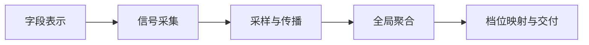

# 阶段 2：数据处理 Pipeline 与编号假设（flowtest）

**端到端摘要**：字段元数据 → 向量表示与邻域图 →（LLM 或模拟器）产生 Pointwise 或 Pairwise 观测 → 可选 Top-K 传播扩充边 → 全局聚合（含 ROMVI）→ 连续得分映射为 L1–L5 → 输出排序、等级与证据链（对比对与邻域路径）。

---

## 1. 分环节说明（每环节两种路径）

| 环节 | 输入 | 输出 | 路径 A（主） | 路径 B（备选） | 进入流水线的假设 | 验证思路 | 若假设错会怎样 | 主要风险 |
|------|------|------|--------------|----------------|------------------|----------|----------------|----------|
| **S1 字段表示** | Schema：名/注释/类型等 | 向量 \(\mathbf{e}_i\) 或特征字典 | **A**：sentence-transformer 类 Embedding | **B**：规则特征 + 哈希/稀疏向量 | （工作）Embedding 空间中间距与「该和谁比」业务相关 | 换 A/B 看邻域纯度或下游 τ | 传播带去错误比较对象 | 域外字段 OOD |
| **S2 信号采集** | 字段描述 | 等级或成对偏好 | **A**：Pairwise \(f_i \succ f_j\)（概率/胜负） | **B**：Pointwise L1–L5 | **H1**：Pairwise 导出的全序与金标准更一致 | `lab_1` 合成与可控噪声下比 Kendall τ / 分档 Acc | 退回 Pointwise 或混合 | LLM 成本、提示敏感 |
| **S3 采样与传播** | Embedding、预算 \(B\) | 稀疏成对观测集 | **A**：锚点比较 + **Top-K 相似传播**扩充边 | **B**：随机或均匀图采样，不传播 | **H2**：同等质量下 Top-K 传播**更少**有效询问/边 | `lab_2` 固定预算比 τ 或达阈所需边数 | 仅用随机采样或增大 K | 传播放大错误 |
| **S4 全局聚合** | 有向/加权胜负边 | 全局得分向量 \(\mathbf{v}\) | **A**：ROMVI — 构造 \(M\) 后 **幂迭代主特征向量** | **B**：行和/胜负分简单加总，或仅传递闭包 | **H3**：噪声下边翻转时，ROMVI **τ 更高或跌幅更小** | `lab_3` 注入边噪声，对照 A/B | 换 Rank Centrality / BT MLE | \(M\) 构造与理论叙述需一致 |
| **S5 档位映射** | \(\mathbf{v}\)、业务阈值 | L1–L5 + 解释材料 | **A**：分位数或等宽分箱到 5 档 | **B**：锚点字段定标 + 插值 | （工作）单调映射保留排序即可审计 | 需真实业务锚点数据；flowtest 以合成序为主 | 档位与合规定义脱节 | 法规区隔差异 |

---

## 2. 编号假设（映射 `lab_{编号}_*`）

### H1：Pairwise 相对 Pointwise 更有利于恢复真实敏感序

**陈述**：在相同总调用预算或可比噪声模型下，基于成对比较（再经简单聚合）得到的字段排序，与金标准排序的 Kendall τ（及映射到 L1–L5 后的准确率）**高于**直接 Pointwise 五级分类。

**说明**：不预设具体 LLM；可用**模拟观测**（按真序加噪）先验证书信链条，再迁移到真实 API。

**通过判据（合成）**：多随机种子重复，Pairwise 的 τ 均值显著高于 Pointwise（具体阈值在 `lab_1` 的 `design.md`）。

**对应实验**：`flowtest/experiment/lab_1_pairwise_vs_pointwise/`。

---

### H2：Top-K 相似传播降低达到目标排序质量所需的比较量

**陈述**：在固定 Embedding 与真序已知（或隐变量生成）的设置下，采用「一次比较向 Top-K 邻域传播虚拟边（带置信/阈值）」的策略，比「不传播、仅随机采样成对」在**相同边预算**下达到更高的 τ，或在**达到相同 τ 阈值**时需要更少的边。

**对应实验**：`flowtest/experiment/lab_2_topk_propagation_cost/`。

---

### H3：ROMVI（主特征向量迭代）在成对噪声下比简单加总更稳健

**陈述**：对由成对胜负构造的矩阵 \(M\)，在边观测中注入一定比例随机翻转时，基于幂迭代得到的 Perron 向量排序，比「仅用胜负净胜场/行和」作为得分**具有更高的 Kendall τ 或更小的 τ 跌幅**。

**对应实验**：`flowtest/experiment/lab_3_romvi_noise_robustness/`。

---

## 3. 暂不纳入 flowtest 的环节（可后续补 lab）

- **S5 全链路**：真实业务锚点、法规档位映射 — 需脱敏数据与法务口径，本目录实验以 **S1–S4 的合成验证**为主。
- **真实 LLM 调用**：成本高；`params.json5` 中预留 `use_llm: false` 与模拟噪声参数，后续可接 API 复跑。

---

## 完成标准自检（进入阶段 3 前）

- [x] 每环节至少 **两条路径** 已写清前提与验证思路。
- [x] **H1–H3** 编号稳定，且目录名可映射为 `lab_1_*`、`lab_2_*`、`lab_3_*`。
